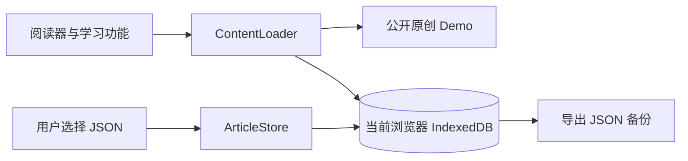

# 词阅 Ciyue

**在你真正感兴趣的英文内容里学习英语。**

词阅是面向 CET-4 / CET-6 学习者的本地优先英文阅读器。它把文章阅读、词汇识别、点词查义、中文对照、生词复习和阅读续读放在同一条学习流程里。项目自带三篇原创双语 Demo；你也可以导入自己的 JSON 文章库。

## 功能

- CET 词汇高亮与阅读中点词查义
- 按句查看中英对照，把生词连同原句收入生词本
- 管理已认识词汇，记录阅读历史并恢复上次位置
- 导入、导出和清空本机私人文章库
- PWA 页面和移动端布局

## 开始使用

无需安装依赖或构建。用本地静态服务器打开项目：

```bash
python -m http.server 8123
```

浏览器访问 <http://localhost:8123>。首次进入即可阅读 Demo。进入「我的」→「我的内容」，选择 **导入文章库**，导入 `ciyue-library.json`；文章导入后保存在当前浏览器的 IndexedDB 中，刷新页面仍会保留。

在同一位置选择 **导出文章库**，可下载 JSON 备份并导入另一台设备。文章库备份包含文章全文、译文及内嵌图片，请像其他私人文件一样妥善保管。文章库和阅读进度是两种备份：阅读进度与生词请使用「数据与备份」下的进度备份功能。

## 导入格式

文章库必须包含版本号和 `articles` 数组；每篇文章必填 `id`、`title`、`content`，其他字段可省略。相同 ID 默认跳过；Demo 使用的 ID 会被保留。结构或版本错误会在写入前拒绝，不会覆盖已有文章。

```json
{
  "product": "Ciyue",
  "schemaVersion": 1,
  "articles": [
    {
      "id": "my-reading-001",
      "title": "A Small Example",
      "author": "",
      "sourceName": "",
      "sourceUrl": "",
      "category": "自选",
      "language": "en",
      "content": "A short English paragraph.\n\nA second paragraph.",
      "translation": "一段简短的英文。\n\n第二段。",
      "tags": []
    }
  ]
}
```

导出的正式文件还会保存时间、文章元数据、可选的文章词典和图片数据。`content` 与 `translation` 按空行分段；如果译文缺失，英文仍可阅读。

## 内容与数据边界



- 公开应用只随仓库提供少量原创 Demo，不内置私人文章库。
- 用户导入的正文、译文和文章词典保存在本机 IndexedDB；应用没有账号或云同步，也不会自动发布导入内容。
- 阅读位置、词汇状态和界面设置仍由现有本地学习状态机制管理；导出文章库不会替代进度备份。
- 私人库导入与 Demo 使用同一 Article 格式，因此两类文章共享阅读、查词和翻译功能。
- 文章封面与配图可随文章库 JSON 一起保存。迁移生成的图片以内嵌数据形式保留，避免依赖仓库中的私人图片文件。

本项目是阅读工具，不是文章内容发行平台。请仅导入你有权保存和使用的内容。公开 Demo 为本项目原创；词汇及词典资源仍分别遵循其原始来源的许可和署名要求。

## 结构

```text
index.html
assets/
  app.js                    页面、阅读与学习交互
  data.js                   词汇与词库数据
  data/demo-articles.js     原创公开 Demo
  services/
    article-schema.js       Article v1 校验与归一化
    article-store.js        IndexedDB 导入、导出和读取
    content-loader.js       合并 Demo 与本机文章
  covers/demo/              Demo 封面
tools/
  migrate-article-library.mjs  一次性转换旧文章库
```

前端是纯静态 JavaScript，无构建步骤。Node 工具用于数据维护与回归；私人库迁移脚本读取旧版文章数据，仅用于本机迁移，不是浏览器运行依赖。

## 词汇数据来源

| 数据 | 来源 | 许可或说明 |
| --- | --- | --- |
| 词频、音标、词形与释义 | [ECDICT](https://github.com/skywind3000/ECDICT) | MIT |
| 真题词频 | [liut969/CET](https://github.com/liut969/CET) | 作者公开资料，使用时遵循上游说明 |
| 试卷词频 | [exam-data/CETVocabulary](https://github.com/exam-data/CETVocabulary) | 数据 CC BY-NC-SA 4.0，代码 MIT |
| 中学词表及例句 | [KyleBing/english-vocabulary](https://github.com/KyleBing/english-vocabulary) | 按上游声明用于学习 |
| 双语例句补充 | [Tatoeba](https://tatoeba.org) | CC BY 2.0 |

仓库目前没有声明覆盖整个项目的统一软件许可证。各词汇数据按上游许可分别使用；在添加统一许可证或接受外部贡献前，请先确认代码与数据的许可边界。

## 回归检查

维护时可运行项目现有的静态和功能回归脚本：

```bash
node tools/audit.js
node tools/sw-test.js
node tools/version-test.mjs
```

文章导入、刷新持久化、重复 ID 跳过、损坏 JSON 拒绝和导出结构，应在浏览器中分别核对。静态检查不能代替实际浏览器或目标 Android 设备上的验证。
